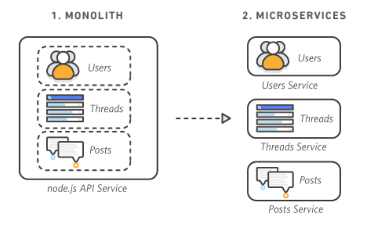
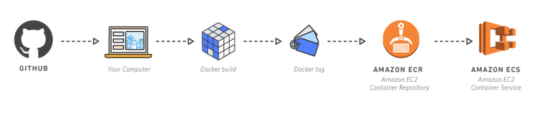

# Monolith-Application

### Break a Monolith Application into Microservices with Amazon Elastic Container Service, Docker, and Amazon EC2

In this project, I will deploy a monolithic node.js application to a Docker container, then decouple the application into microservices without any downtime. The node.js application hosts a simple message board with threads and messages between users.

#### Why this Process Matters

The traditional monolithic architectures are hard to scale. When introducing new features, languages, frameworks, and technologies becomes very hard, limiting innovation and new ideas.

Whereas within a microservices architecture, each application component runs as its own service and communicates with other services via a well-defined API. This architecture can be written using different framewords and programming languages, and can deploy them independently, as a single service, or as a group of services.

#### Application Architecture

For this project, I will demonstrate how to run to run a simple monolithic application in a Docker container, deploy the same application as microservices, then switch traffic to the microservices without any downtime.

**Monolithic Architecture**

As the picture above indicates, the entire node.js application is run in a container as a single service and each container has the same features as all other containers. If one application feature experiences a spike in demand, the entire architecture must be scaled.

**Microservices Architecture**

Each feature of the node.js application in the microservices architecture, runs as a separate service within its own container. The services can scale and be updated independently of the others.

This project consists of 5 mondules:

**Module 1:** Containerize the Monolith

**Module 2:** Deploy the Monolith

**Module 3:** Break the Monolith

**Module 4:** Deploy Microservices

**Module 5:** Clean Up

#### Let's get started !!!!

### Module 1 - Containerize the Monolith

In this module, I will build the container image for the monolithic node.js application and push it to Amazon Elastic Container Registry. This diagram below demonstrates how the process will go.

Before implement Module 1, it is important to understand the concepts of **container**.

#### What Is a Container?

A container is a standard unit of software that packages up code and all its dependencies so the application runs quickly and reliably from one computing environment to another.

#### Why Use Containers?

Most companies utilize containers for their applications because of :

**Speed:** Containers are lighweight, can be create and destroy in a fraction of seconds. They allow developers to work more effectively.

**Dependency Control & Improved Pipeline:** A Docker container image is a point in time capture of an application's code and dependencies. This allows an engineering organization to create a standard pipeline for the application life cycle.

**Density & Resource Efficiency:** Containers facilitate enhanced resource efficiency by allowing multiple heterogeneous processes to run on a single system.  

**Flexibility:** The flexibility of Docker containers is based on their portability, ease of deployment, and small size.

### Implementation Instructions

For the first part of this project, I will build the Docker container image for my monolithic node.js application and push it to Amazon Elastic Container Registry (Amazon ECR). 

In the next few steps, I will be using **Docker**, **Github**, **Amazon Elastic Container Service (Amazon ECS)**, and **Amazon ECR** to deploy code into containers. To complete these steps, ensure you have the following tools.

#### Prerequisites

**1-** Have an Aws account.

**2-** Install Docker.

**3-** Install the AWS CLI.

**4-** Have a text editor.

