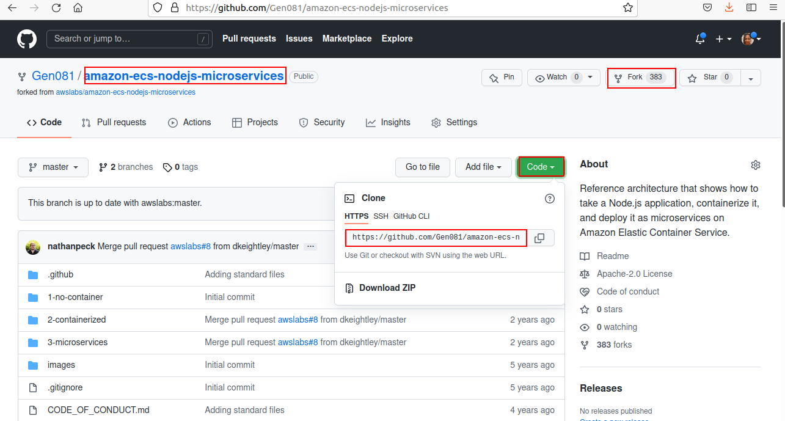
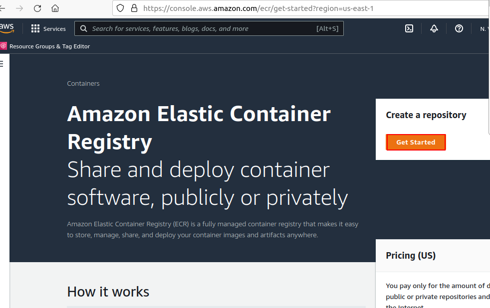
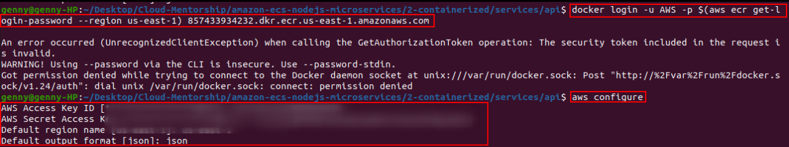
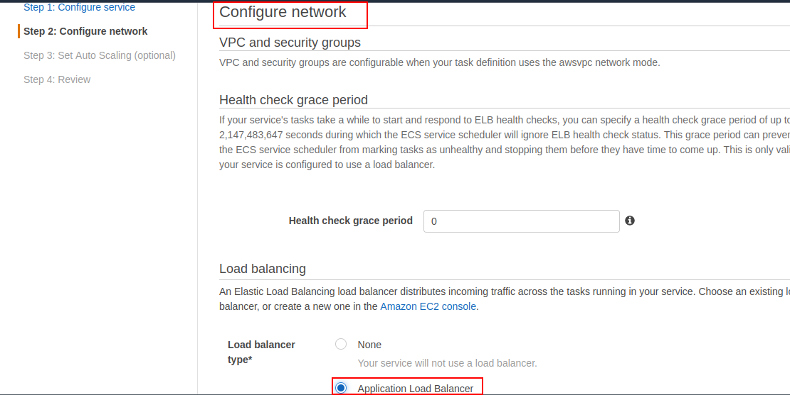
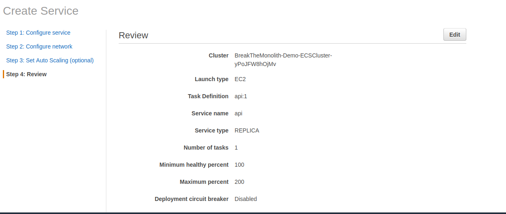
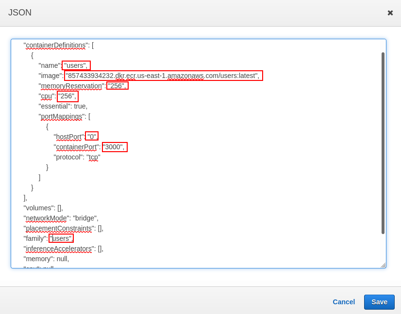
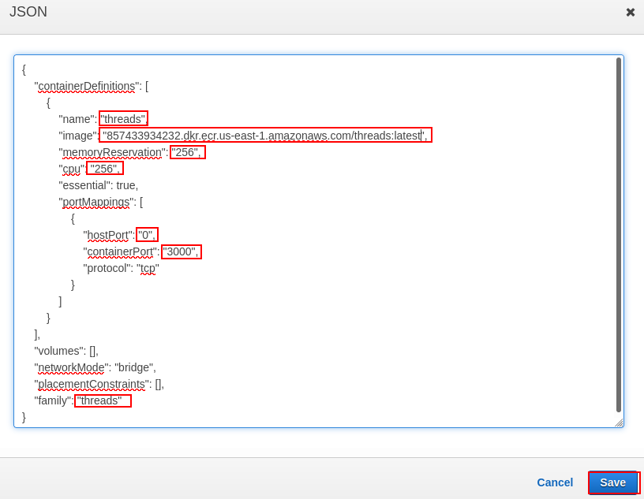
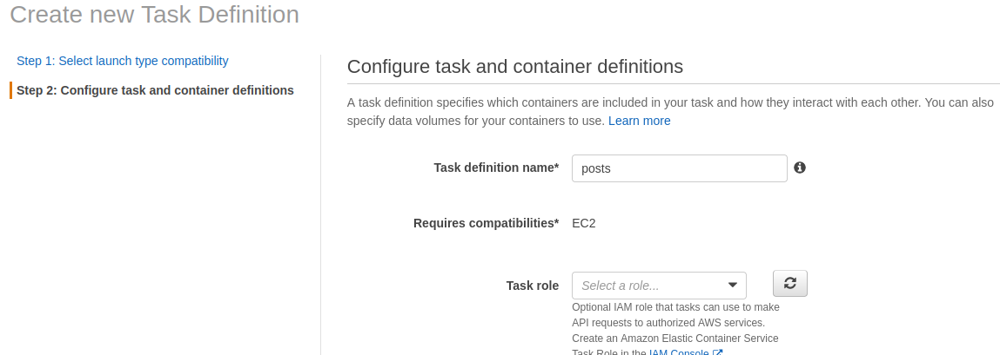
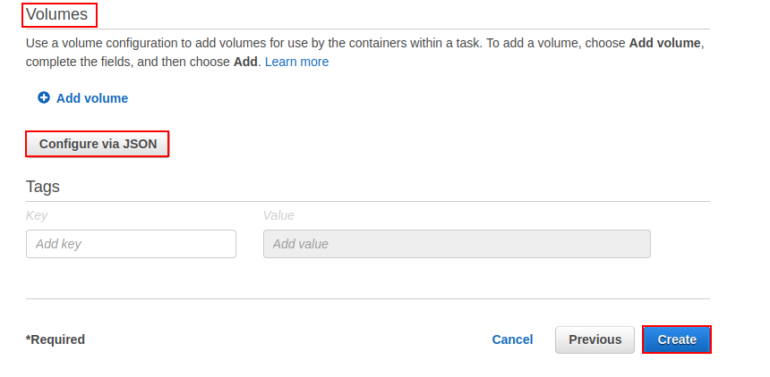
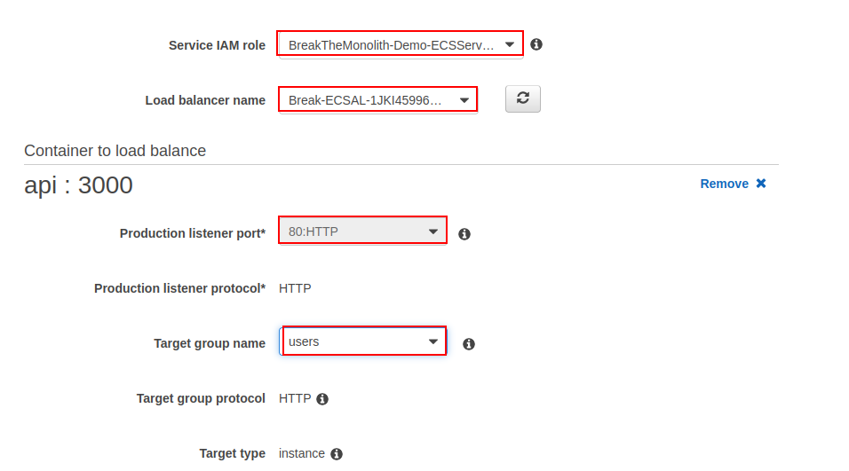

# Monolith-Application

### Break a Monolith Application into Microservices with Amazon Elastic Container Service, Docker, and Amazon EC2


In this project, I will deploy a monolithic node.js application to a Docker container, then decouple the application into microservices without any downtime. The node.js application hosts a simple message board with threads and messages between users.


#### Why this Process Matters

The traditional monolithic architectures are hard to scale. When introducing new features, languages, frameworks, and technologies becomes very hard, limiting innovation and new ideas.

Whereas within a microservices architecture, each application component runs as its own service and communicates with other services via a well-defined API. This architecture can be written using different framewords and programming languages, and can deploy them independently, as a single service, or as a group of services.

#### Application Architecture

For this project, I will demonstrate how to run to run a simple monolithic application in a Docker container, deploy the same application as microservices, then switch traffic to the microservices without any downtime.


**Monolithic Architecture**

As the picture above indicates, the entire node.js application is run in a container as a single service and each container has the same features as all other containers. If one application feature experiences a spike in demand, the entire architecture must be scaled.

**Microservices Architecture**

Each feature of the node.js application in the microservices architecture, runs as a separate service within its own container. The services can scale and be updated independently of the others.


This project consists of 5 mondules:

**Module 1:** Containerize the Monolith

**Module 2:** Deploy the Monolith

**Module 3:** Break the Monolith

**Module 4:** Deploy Microservices

**Module 5:** Clean Up


#### Let's get started !!!!


### Module 1 - Containerize the Monolith

In this module, I will build the container image for the monolithic node.js application and push it to Amazon Elastic Container Registry. This diagram below demonstrates how the process will go.


Before implement Module 1, it is important to understand the concepts of **container**.

#### What Is a Container?

A container is a standard unit of software that packages up code and all its dependencies so the application runs quickly and reliably from one computing environment to another.

#### Why Use Containers?

Most companies utilize containers for their applications because of :

**Speed:** Containers are lighweight, can be create and destroy in a fraction of seconds. They allow developers to work more effectively.

**Dependency Control & Improved Pipeline:** A Docker container image is a point in time capture of an application's code and dependencies. This allows an engineering organization to create a standard pipeline for the application life cycle.

**Density & Resource Efficiency:** Containers facilitate enhanced resource efficiency by allowing multiple heterogeneous processes to run on a single system.  

**Flexibility:** The flexibility of Docker containers is based on their portability, ease of deployment, and small size.


### Implementation Instructions

For the first part of this project, I will build the Docker container image for my monolithic node.js application and push it to Amazon Elastic Container Registry (Amazon ECR). 

In the next few steps, I will be using **Docker**, **Github**, **Amazon Elastic Container Service (Amazon ECS)**, and **Amazon ECR** to deploy code into containers. To complete these steps, ensure you have the following tools.

#### Prerequisites

**1-** Have an Aws account.

**2-** Install Docker.

**3-** Install the AWS CLI.

**4-** Have a text editor.


Let's start with the Prerequisites instructions: 

**1- Have an AWS account.**


**2- Install Docker.**

These are the commands use to install Docker on a Terminal.


**3- Install AWS CLI.**

**Note:** Before installing AWS CLI, it is very important to follow the prerequisites, otherwise there will be **Permission Denied**


**Note:** AWS CLI can be install on Linux, MacOS and WIndows. I will be using Linux.

Installation instructions:

1- Download the installation file, using this command:

```
curl "https://awscli.amazonaws.com/awscli-exe-linux-x86_64.zip" -o "awscliv2.zip"
```

2- Unzip the installer by typing:

```
unzip awscliv2.zip
```

3- Run the install program. The installation command uses a file named install in the newly unzipped aws directory.

```
sudo ./aws/install
```

4- Confirm the installation with the following command. 

```
aws --version
```


**3- Have a text editor.**

I will be using Visual Studio code (VScode) as text editor for this project.


After complete the prerequisites instructions let's download the code from GitHub: Navigate to https://github.com/awslabs/mazon-ecs-nodejs-microservices and select Clone or Download to download the GitHub repository to my local environment. I can also use GitHub Desktop or Git to clone the repository.




Next Step:


**Create the repository:**

**Note:** Login on AWS account with the IAM User credentials which was provided from the excel sheet when creating the USER.

Then


- Navigate to the [Amazon ECR console](https://console.aws.amazon.com/ecs/home?#/repositories).
- On the **Repositories** page, select **Create Repository**.
- On the Create repository page, enter the following name your repository: *api* **Note:** Under **Tag immutability**, leave the default settings.
- Select **Create repository**.




Use the terminal to authenticate Docker log in:

```
docker login -u AWS -p $(aws ecr get-login-password --region the-region-you-are-in) xxxxxxxxx.dkr.ecr.the-region-you-are-in.amazonaws.com
```




If after executing the ```aws configure``` command, still getting an ```permission denied```, type ```sudo``` in front of the docker login command :

```
sudo docker login -u AWS -p $(aws ecr get-login-password --region us-east-1) 857433934232.dkr.ecr.us-east-1.amazonaws.com
```


Next, to build and push the image to Amazon ECR, run the following commands:


If there is ```permission denied```, then add ```sudo``` in front of the following commands


### Module 2 - Deploy the Monolith

In this module, I will use Amazon Elastic Container Service (Amazon ECS) to instantiate a managed cluster of EC2 compute instances and deploy the image as a container running on the cluster.

#### Architecture Overview


Let's talk about this diagram in details.

**a. Client:** The client makes a request over port 80 to the load balancer.

**b. Load Balancer:** The load balancer distributes requests across all available ports.

**c. Target Groups:** Instances are registered in the application's target group.

**d. Container Ports:** Each container runs a single application process which binds the node.js cluster parent to port 80 within its namespace.

**e. Containerized node.js Monolith:** The node.js cluster parent is responsible for distributing traffic to the workers within the monolithic application. This architecture is containerized, but still monolithic because each container has all the same features of the rest of the containers.

### What is Amazon Elastic Container Service?
Amazon Elastic Container Service (Amazon ECS) is a highly scalable, high performance container management service that supports Docker containers and allows you to easily run applications on a managed cluster of Amazon EC2 instances.

There is no additional charge for Amazon ECS. You pay for the AWS resources (for example, EC2 instances or EBS volumes) you create to store and run your application.

**Services Used:**

- [Amazon Elastic Container Service](https://aws.amazon.com/ecs/)
- [Amazon Elastic Container Registry](https://aws.amazon.com/ecr/)
- [AWS CloudFormation](https://aws.amazon.com/cloudformation/)
- [Elastic Load Balancing](https://aws.amazon.com/elasticloadbalancing/applicationloadbalancer/)


### Implementation Instructions

Follow the step-by-step instructions below to deploy the node.js application using Amazon ECS.


Create an Amazon ECS cluster deployed behind an Application Load Balancer. In order to do so, let's navigate to the AWS CloudFormation console. [AWS CloudFormation](https://aws.amazon.com/cloudformation/)

**Step 1:** Create a Stack


Select Upload a template file and choose the ecs.yml file from the GitHub project at amazon-ecs-nodejs-microservice/2-containerized/infrastructure/ecs.yml then select Next.


On the **Configure stack options** page, keep the default options and scroll down and select **Next**.


**Step 2. Check the Cluster is Running**

Let's navigate to the [Amazon ECS console](https://console.aws.amazon.com/ecs/home?). My cluster should appear in the list.


- Select the cluster BreakTheMonolith-Demo, then select the Tasks tab to verify that there are no tasks running.


- Select the **ECS Instances** tab to verify there are two Amazon EC2 instances created by the AWS CloudFormation template.


Task definitions specify how Amazon ECS deploys the application containers across the cluster.

From the Amazon ECS left navigation menu, select **Task Definitions**. Then Select **Create new Task Definition**


- On the **Select launch type compatibility** page, select the **EC2** option then select **Next step**.


On the **Configure task and container definitions** page, do the followings:


In the Add container window, do the followings:


The Application Load Balancer (ALB) lets your service accept incoming traffic. The ALB automatically routes traffic to container instances running on your cluster using them as a target group.


**Check your VPC Name:** 

In order to do so, let's
- Navigate to the [Load Balancer section of the EC2 Console](https://console.aws.amazon.com/ec2/v2/home?#LoadBalancers:).


**Configure the ALB Target Group**

- Navigate to the [Target Group section of the EC2 Console.](https://console.aws.amazon.com/ec2/v2/home?#TargetGroups:)


- Select **Create target group**.


The ALB listener checks for incoming connection requests to your ALB.

**Add a Listener to the ALB**

- Navigate to the [Load Balancer section of the EC2 Console](https://console.aws.amazon.com/ec2/v2/home?#LoadBalancers:).


Deploy the monolith as a service into the cluster, follow these steps.

- Navigate to the [Amazon ECS console](https://console.aws.amazon.com/ecs/home?) and select **Clusters** from the left menu bar.


- On the **Configure service** page, edit the following parameters (and keep the default values for parameters not listed below):
  - For the **Launch type**, select **EC2**.
  - For the **Service name**, enter *api*.
  - For the **Number of tasks**, enter *1*.
  - Select **Next step**.








**To Find your Service URL:**

- Navigate to the [Load Balancers](https://console.aws.amazon.com/ec2/v2/home?#LoadBalancers:) section of the EC2 Console.
- Select your load balancer **demo**.
- In the **Description** tab, copy the DNS name and paste into a new browser tab or window.
- You should see the message **Ready to receive requests**.


**See Each Part of the Service:** The node.js application routes traffic to each worker based on the URL. To see a worker, simply add the worker name api/[worker-name] to the end of the DNS Name as follows:

- http://*[DNS name]*/api/users
```
http://break-ecsal-1jki45996w4dh-1812061595.us-east-1.elb.amazonaws.com/api/users
```


- http://*[DNS name]*/api/threads

```
http://break-ecsal-1jki45996w4dh-1812061595.us-east-1.elb.amazonaws.com/api/threads
```


- http://*[DNS name]*/api/posts

```
http://break-ecsal-1jki45996w4dh-1812061595.us-east-1.elb.amazonaws.com/api/posts
```


### Module 3 - Break the Monolith

In this module, I will break the node.js application into several interconnected services and push each service's image to an Amazon Elastic Container Registry (Amazon ECR) repository.

#### Architecture Overview

The final application architecture uses Amazon Elastic Container Service (Amazon ECS) and the Application Load Balancer (ALB).


**a. Client:** The client makes traffic requests over port 80.

**b. Load Balancer:** The ALB routes external traffic to the correct service. The ALB inspects the client request and uses the routing rules to direct the request to an instance and port for the target group matching the rule.

**c. Target Groups:** Each service has a target group that keeps track of the instances and ports of each container running for that service.

**d. Microservices:** Amazon ECS deploys each service into a container across an EC2 cluster. Each container only handles a single feature.


#### Why Microservices?

There are several reasons why companies nowadays implement microservices:

**Isolation of Crashes:** Good microservice architecture means that if one micro piece of your service is crashing, then only that part of your service will go down. The rest of your service can continue to work properly.

**Isolation for Security:**
When microservice best practices are followed, the result is that if an attacker compromises one service, they only gain access to the resources of that service, and cannot horizontally access other resources from other services without breaking into those services as well.

**Independent Scaling:** When features are broken out into microservices, then the amount of infrastructure and number of instances used by each microservice class can be scaled up and down independently.

**Development Velocity:** Developers can be confident that any code they write will actually not be able to impact the existing code at all unless they explicitly write a connection between two microservices.


**Services Used:**

- [Amazon Elastic Container Registry](https://aws.amazon.com/ecr/)


#### Implementation Instructions

In the previous modules, I deployed my application as a monolith using a single service and a single container image repository.  In this module, I will break the monolith, meaning I will deploy the application as three microservices, therefore I will need to provision three repositories (one for each service) in Amazon ECR.

The three services are:

**1.** users

**2.** threads

**3.** posts

Let's create repository for each service in Amazon ECR.


To build and tag image of each service to docker, let's first open the terminal, and set the path from the project file to ```~/amazon-ecs-nodejs-microservices/3-microservices/services```

- For service: **Users**

Let's authenticate Docker login with ```users``` repository information:


```
sudo docker login -u AWS -p $(aws ecr get-login-password --region us-east-1) 857433934232.dkr.ecr.us-east-1.amazonaws.com
```

**Note**
If there is a permission denied error message, please add sudo before the command:


Build,Tag and Push Image with the following commands:


- For service: **Threads**

Let's authenticate Docker login with 
```threads``` repository information:

```
sudo docker login -u AWS -p $(aws ecr get-login-password --region us-east-1) 857433934232.dkr.ecr.us-east-1.amazonaws.com
```


Build,Tag and Push Image with the following commands:


- For service: **Posts**

Let's authenticate Docker login with 
```posts``` repository information:

```
sudo docker login -u AWS -p $(aws ecr get-login-password --region us-east-1) 857433934232.dkr.ecr.us-east-1.amazonaws.com
```


Build,Tag and Push Image with the following commands:


### Module 4 - Deploy Microservices

In this module, I will deploy the node.js application as a set of interconnected services behind an Application Load Balancer (ALB). Then, I will use the ALB to seamlessly shift traffic from the monolith to the microservices. 


#### Architecture Overview

This architecture will deploy the microservices and safely transition the application's traffic away from the monolith.


Here is a description of this above architecture.

1. **Switch the Traffic** This is the starting configuration. The monolithic node.js app running in a container on Amazon ECS.
2. **Start Microservices** Using the three container images you built and pushed to Amazon ECR in the previous module, you will start up three microservices on your existing Amazon ECS cluster.
3. **Configure the Target Groups** Like in Module 2, you will add a target group for each service and update the ALB Rules to connect the new microservices.
4. **Shut Down the Monolith** By changing one rule in the ALB, you will start routing traffic to the running microservices. After traffic reroute has been verified, shut down the monolith.

**Services Used:**

- [Amazon Elastic Container Service](https://aws.amazon.com/ecs/)
- [Amazon Elastic Container Registry](https://aws.amazon.com/ecr/)
- [AWS CloudFormation](https://aws.amazon.com/cloudformation/)
- [Elastic Load Balancing](https://aws.amazon.com/elasticloadbalancing/applicationloadbalancer/)


#### Implementation Instructions

The step-by-step instructions below will deploy the microservices.

I will deploy three new services to the cluster that I launched in Module 2. Like Module 2, I will write Task Definitions for each service.


To speed things up, in this next step I will create task definitions for each service (users, threads, posts) from the Amazon ECS console by writing them as JSON.

Here is the JSON template:

```
{
    "containerDefinitions": [
        {
            "name": "[service-name]",
            "image": "[account-id].dkr.ecr.[region].amazonaws.com/[service-name]:[tag]",
            "memoryReservation": "256",
            "cpu": "256",
            "essential": true,
            "portMappings": [
                {
                    "hostPort": "0",
                    "containerPort": "3000",
                    "protocol": "tcp"
                }
            ]
        }
    ],
    "volumes": [],
    "networkMode": "bridge",
    "placementConstraints": [],
    "family": "[service-name]"
}
```

Follow these steps below: 

1. From the [Amazon Container Services console](https://console.aws.amazon.com/ecs/home/), under **Amazon ECS**, select **Task definitions**.

2. In the **Task Definitions** page, select the **Create new Task Definition** button.
3. In the **Select launch type compatibility** page, select the **EC2** option and then select **Next step**.
4. In the Configure task and container definitions page, scroll to the **Volumes** section and select the **Configure via JSON** button.
5. Copy and paste the following code snippet into the JSON field, replacing the existing code.Remember to replace the [service-name], [account-ID], [region], and [tag] placeholders.


- For Service: **Users**





- For Service: **Threads**





- For Service: **Posts**







As in Module 2, configure a target group for each service (posts, threads, and users). A target group allows traffic to correctly reach a specified service. I will configure the target groups using AWS CLI. However, before proceeding, ensure the correct VPC name that is being used for this project: 

- Navigate to the [Load Balancer section of the EC2 Console](https://console.aws.amazon.com/ec2/v2/home?#LoadBalancers:).
- Select the checkbox next to demo, select the **Description** tab, and locate the **VPC** attribute (in this format: vpc-xxxxxxxxxxxxxxxxx). **Note:** You will need the VPC attribute when you configure the target groups.


#### Configure the Target Groups

Service names: posts, threads, users, and drop-traffic

```
aws elbv2 create-target-group --region [region] --name [service-name] --protocol HTTP --port 80 --vpc-id [vpc-attribute] --healthy-threshold-count 2 --unhealthy-threshold-count 2 --health-check-timeout-seconds 5 --health-check-interval-seconds 6
```

- For Service: **Users**


- For Service: **Threads**


- For Service: **Posts**


- For Service: **Drop-Traffic**


The listener checks for incoming connection requests to your ALB in order to route traffic appropriately.

To make the transition from monolith to microservices, I will start routing traffic to the microservices and stop routing traffic to the monolith.

**Access the listener rules**

- Navigate to the [Load Balancer section of the EC2 Console](https://console.aws.amazon.com/ec2/v2/home?#LoadBalancers:).
- Locate the Load Balancer named **demo** and select the checkbox next to it to see the Load Balancer details.
- Select the **Listeners** tab.


**Update the listener rules**

There should only be one listener listed in this tab. Take the following steps to edit the listener rules:


- Use the following rule template to insert the necessary rules for each service:
  - IF Path = /api/[service-name]* THEN Forward to [service-name]For example: IF Path = /api/posts* THEN Forward to posts

  - Insert the rules in the following order:
    - api: */api** forwards to *api*
    - users: */api/users** forwards to *users*
    - threads: */api/threads** forwards to *threads*
    - posts: */api/posts** forwards to *posts*


Deploy the three microservices (posts, threads, and users) to the cluster. Repeat these steps for each of the three microservices:


- For Service: **Users**


Navigate to the [Amazon ECS console](https://console.aws.amazon.com/ecs/home) and select **Clusters** from the left menu bar.

Select the cluster **BreakTheMonolith-Demo**, select the **Services** tab then select **Create**.


On the Configure service page, edit the following parameters:


On the Configure network page, edit the following parameters:





