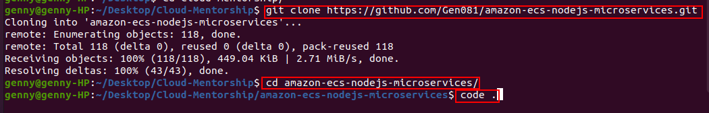

# Monolith-Application

### Break a Monolith Application into Microservices with Amazon Elastic Container Service, Docker, and Amazon EC2


In this project, I will deploy a monolithic node.js application to a Docker container, then decouple the application into microservices without any downtime. The node.js application hosts a simple message board with threads and messages between users.


#### Why this Process Matters

The traditional monolithic architectures are hard to scale. When introducing new features, languages, frameworks, and technologies becomes very hard, limiting innovation and new ideas.

Whereas within a microservices architecture, each application component runs as its own service and communicates with other services via a well-defined API. This architecture can be written using different framewords and programming languages, and can deploy them independently, as a single service, or as a group of services.

#### Application Architecture

For this project, I will demonstrate how to run to run a simple monolithic application in a Docker container, deploy the same application as microservices, then switch traffic to the microservices without any downtime.


**Monolithic Architecture**

As the picture above indicates, the entire node.js application is run in a container as a single service and each container has the same features as all other containers. If one application feature experiences a spike in demand, the entire architecture must be scaled.

**Microservices Architecture**

Each feature of the node.js application in the microservices architecture, runs as a separate service within its own container. The services can scale and be updated independently of the others.


This project consists of 5 mondules:

**Module 1:** Containerize the Monolith

**Module 2:** Deploy the Monolith

**Module 3:** Break the Monolith

**Module 4:** Deploy Microservices

**Module 5:** Clean Up


#### Let's get started !!!!


### Module 1 - Containerize the Monolith

In this module, I will build the container image for the monolithic node.js application and push it to Amazon Elastic Container Registry. This diagram below demonstrates how the process will go.


Before implement Module 1, it is important to understand the concepts of **container**.

#### What Is a Container?

A container is a standard unit of software that packages up code and all its dependencies so the application runs quickly and reliably from one computing environment to another.

#### Why Use Containers?

Most companies utilize containers for their applications because of :

**Speed:** Containers are lighweight, can be create and destroy in a fraction of seconds. They allow developers to work more effectively.

**Dependency Control & Improved Pipeline:** A Docker container image is a point in time capture of an application's code and dependencies. This allows an engineering organization to create a standard pipeline for the application life cycle.

**Density & Resource Efficiency:** Containers facilitate enhanced resource efficiency by allowing multiple heterogeneous processes to run on a single system.  

**Flexibility:** The flexibility of Docker containers is based on their portability, ease of deployment, and small size.


### Implementation Instructions

For the first part of this project, I will build the Docker container image for my monolithic node.js application and push it to Amazon Elastic Container Registry (Amazon ECR). 

In the next few steps, I will be using **Docker**, **Github**, **Amazon Elastic Container Service (Amazon ECS)**, and **Amazon ECR** to deploy code into containers. To complete these steps, ensure you have the following tools.

#### Prerequisites

**1-** Have an Aws account.

**2-** Install Docker.

**3-** Install the AWS CLI.

**4-** Have a text editor.


Let's start with the Prerequisites instructions: 

**1- Have an AWS account.**


**2- Install Docker.**

These are the commands use to install Docker on a Terminal.


**3- Install AWS CLI.**

**Note:** Before installing AWS CLI, it is very important to follow the prerequisites, otherwise there will be **Permission Denied**


**Note:** AWS CLI can be install on Linux, MacOS and WIndows. I will be using Linux.

Installation instructions:

1- Download the installation file, using this command:

```
curl "https://awscli.amazonaws.com/awscli-exe-linux-x86_64.zip" -o "awscliv2.zip"
```

2- Unzip the installer by typing:

```
unzip awscliv2.zip
```

3- Run the install program. The installation command uses a file named install in the newly unzipped aws directory.

```
sudo ./aws/install
```

4- Confirm the installation with the following command. 

```
aws --version
```


**3- Have a text editor.**

I will be using Visual Studio code (VScode) as text editor for this project.


After complete the prerequisites instructions let's download the code from GitHub: Navigate to https://github.com/awslabs/mazon-ecs-nodejs-microservices and select Clone or Download to download the GitHub repository to my local environment. I can also use GitHub Desktop or Git to clone the repository.





Next Step:


**Create the repository:**

**Note:** Login on AWS account with the IAM User credentials which was provided from the excel sheet when creating the USER.

Then


- Navigate to the [Amazon ECR console](https://console.aws.amazon.com/ecs/home?#/repositories).
- On the **Repositories** page, select **Create Repository**.
- On the Create repository page, enter the following name your repository: *api* **Note:** Under **Tag immutability**, leave the default settings.
- Select **Create repository**.


Use the terminal to authenticate Docker log in:

```
docker login -u AWS -p $(aws ecr get-login-password --region the-region-you-are-in) xxxxxxxxx.dkr.ecr.the-region-you-are-in.amazonaws.com
```


If after executing the ```aws configure``` command, still getting an ```permission denied```, type ```sudo``` in front of the docker login command :

```
sudo docker login -u AWS -p $(aws ecr get-login-password --region us-east-1) 857433934232.dkr.ecr.us-east-1.amazonaws.com
```


Next, to build and push the image to Amazon ECR, run the following commands:


If there is ```permission denied```, then add ```sudo``` in front of the following commands


### Module 2 - Deploy the Monolith

In this module, I will use Amazon Elastic Container Service (Amazon ECS) to instantiate a managed cluster of EC2 compute instances and deploy the image as a container running on the cluster.

#### Architecture Overview


Let's talk about this diagram in details.

**a. Client:** The client makes traffic requests over port 80.

**b. Load Balancer:** The ALB (Amazon Load Balancer) routes external traffic to the correct service. The ALB inspects the client request and uses the routing rules to direct the request to an instance and port for the target group matching the rule.

**c. Target Groups:** Each service has a target group that keeps track of the instances and ports of each container running for that service.

**d. Microservices:** Amazon ECS deploys each service into a container across an EC2 cluster. Each container only handles a single feature.

### Why Microservices?

There are several reasons why companies nowadays implement microservices:

**Isolation of Crashes:** Good microservice architecture means that if one micro piece of your service is crashing, then only that part of your service will go down. The rest of your service can continue to work properly.

**Isolation for Security:**
When microservice best practices are followed, the result is that if an attacker compromises one service, they only gain access to the resources of that service, and cannot horizontally access other resources from other services without breaking into those services as well.

**Independent Scaling:** When features are broken out into microservices, then the amount of infrastructure and number of instances used by each microservice class can be scaled up and down independently.

**Development Velocity:** Developers can be confident that any code they write will actually not be able to impact the existing code at all unless they explicitly write a connection between two microservices.
